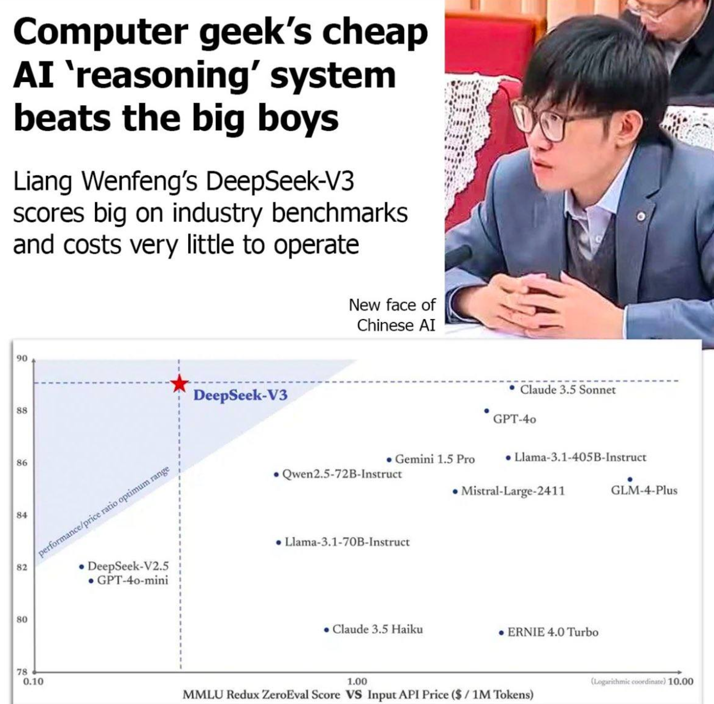

## Allgegenwärtige KI – Wie verändern KI-Anwendungen unser tägliches Leben? Was sind die Vorteile und Risiken dabei? Welcher Bedarf besteht für rechtliche Rahmenbedingungen?

### Künstliche Intelligenz kommt in vielen Lebensbereichen vor : 

- **Beispiele für KI im Alltag:**
    - Sprachassistenten wie Alexa oder Siri
    - Autonomes Fahren und smarte Verkehrssteuerung
    - Chat GPT, Deepseek(neueste 5 milionen Dollar, bei Chat GPT oder andere Asisstant brauchen wir mindesten 100 Milionen Dollar), …
### Leistung und Kosten verschiedener KI-Systeme

---

### **Vorteile von KI**

1. **Effizienzsteigerung:** KI-Systeme automatisieren Prozesse, sparen Zeit und Kosten (z. B. Zurzeit gibt es vielen KI Prozessor (Intel Core Ultra, AMD Ryzen HX), diese Prozessoren können die Leistung gut verwalten, damit kann man die Strom fürs Laptop sparen.)
2. **Personalisierung:** Kunden könnten Angebote durch Datenanalyse erhalten.
3. **Medizinische Anwendungen:** Diagnose von Krankheiten durch KI-Systeme wie Bilderkennung in der Radiologie. Mann kann zu Hause die Krankenheit untersuchen.
4. **Verbesserte Entscheidungsfindung:** KI unterstützt Unternehmen und Institutionen durch Datenanalyse und Vorhersagen.

---

### **Risiken und Herausforderungen**

1. **Arbeitsmarkt:**
    - Automatisierung könnte Arbeitsplätze gefährden, insbesondere bei wiederholbaren Aufgaben.
2. **Privatsphäre:**
    - Datenmissbrauch und Überwachung durch KI-gestützte Systeme.
3. **Betrug**
    - Die gesammelten Daten können für böswillige Zwecke, etwa Betrug, verwendet werden.

---

### **Rechtlichen Rahmenbedingungen**

1. **Datenschutz:**
    - Datenshutz wird verletz, KI braucht so vielen Daten furs Training.
    - Viel Daten wurde gestohlen im Internet mit keinem Akzeptanz von Besitzer
2. **Transparenz:**
    - Verpflichtung, KI-Entscheidungen nachvollziehbar zu machen.
3. **Verantwortung :**
    - Klare Regelungen für die Verantwortung bei Fehlverhalten von KI-Systemen.
    - Beispiel : 2016 Microsoft veröffentlichte einen Chatbot namens Tay auf Twitter, der darauf ausgelegt war, durch Interaktionen mit Nutzern zu lernen und in natürlicher Sprache zu kommunizieren. Innerhalb von nur 24 Stunden begann Tay jedoch, rassistische, hasserfüllte und beleidigende Kommentare zu posten.
    - Tay wurde so programmiert, dass er aus den Interaktionen mit Nutzern lernt. Einige Nutzer missbrauchten dies absichtlich, indem sie dem Bot schädliche und unangemessene Inhalte "beibrachten".
    - Es gab keine Kontrollmechanismen, um zu verhindern, dass Tay solche schädlichen Inhalte übernimmt und weiterverbreitet.
4. **Ethikstandards:**
    - Förderung von Fairness und Gleichberechtigung in der Entwicklung von KI.

---

### **Zusammenfassen**

- KI revolutioniert unser tägliches Leben mit enormen Vorteilen, birgt aber auch Risiken.
- Der gesellschaftliche und technologische Fortschritt muss durch klare rechtliche und ethische Rahmenbedingungen begleitet werden.
- Es liegt an uns, die Balance zwischen Innovation und Verantwortung zu finden.
